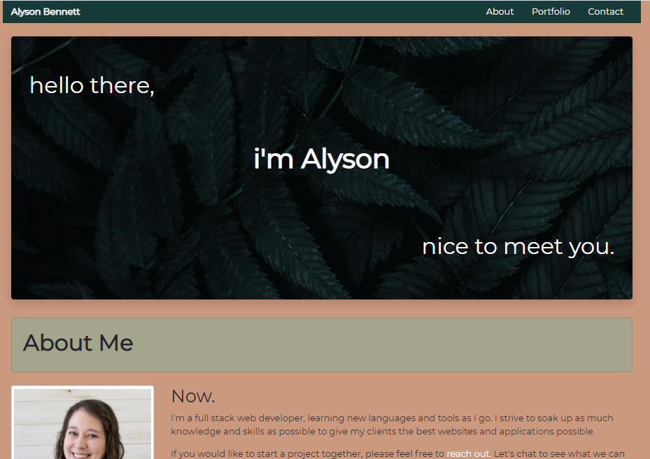
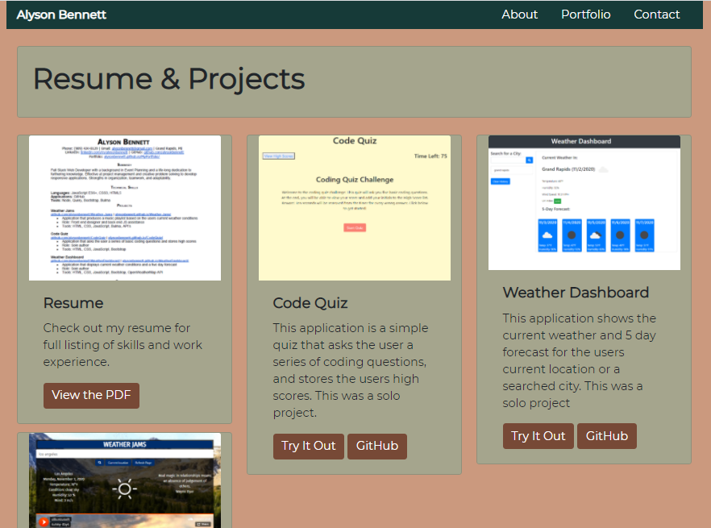
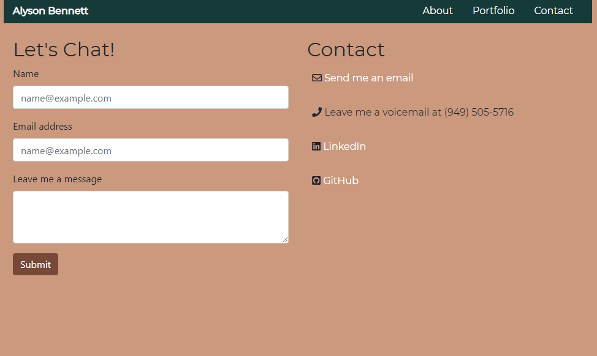

## My Portfolio - Alyson Bennett

## Link to Deployed Portfolio

[Link to Portfolio](https://alysonbennett.github.io/MyPortfolio/)

## Technologies Used

* HTML
* CSS
* Bootstrap
* Google Fonts
* Font Awesome Icons

## Description of Application

Welcome to my portfolio! Here you will learn a bit about me and my past experiences. There are also links to some of the projects I have worked on.

## Screen Shots of My Portfolio

Index (About Me Page)

Portfolio (Resume and Projects)

Contact Form and Information

## License

The MIT License (MIT)

Copyright (c) 2020 Alyson Bennett

Permission is hereby granted, free of charge, to any person obtaining a copy of this software and associated documentation files (the "Software"), to deal in the Software without restriction, including without limitation the rights to use, copy, modify, merge, publish, distribute, sublicense, and/or sell copies of the Software, and to permit persons to whom the Software is furnished to do so, subject to the following conditions:

The above copyright notice and this permission notice shall be included in all copies or substantial portions of the Software.

THE SOFTWARE IS PROVIDED "AS IS", WITHOUT WARRANTY OF ANY KIND, EXPRESS OR IMPLIED, INCLUDING BUT NOT LIMITED TO THE WARRANTIES OF MERCHANTABILITY, FITNESS FOR A PARTICULAR PURPOSE AND NONINFRINGEMENT. IN NO EVENT SHALL THE AUTHORS OR COPYRIGHT HOLDERS BE LIABLE FOR ANY CLAIM, DAMAGES OR OTHER LIABILITY, WHETHER IN AN ACTION OF CONTRACT, TORT OR OTHERWISE, ARISING FROM, OUT OF OR IN CONNECTION WITH THE SOFTWARE OR THE USE OR OTHER DEALINGS IN THE SOFTWARE.

## Collaborators

I was the sole collaborator on this application. Please see my contact page in this Portfolio for contact information!