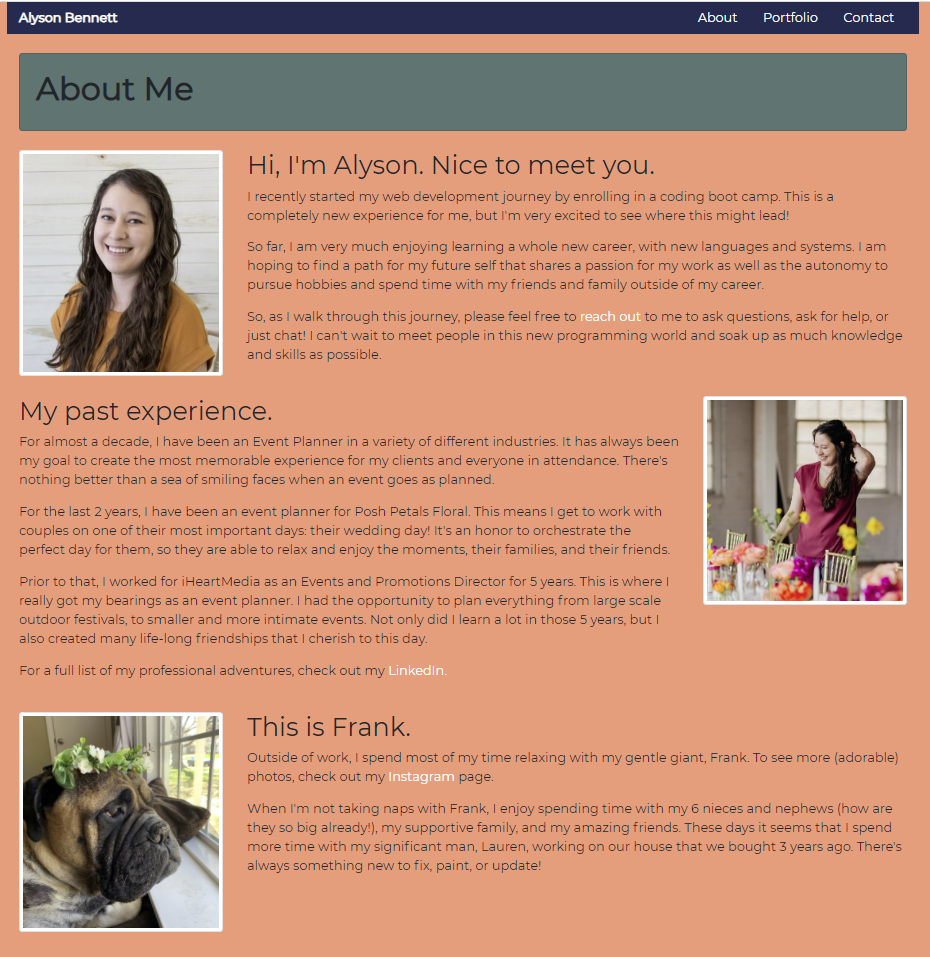
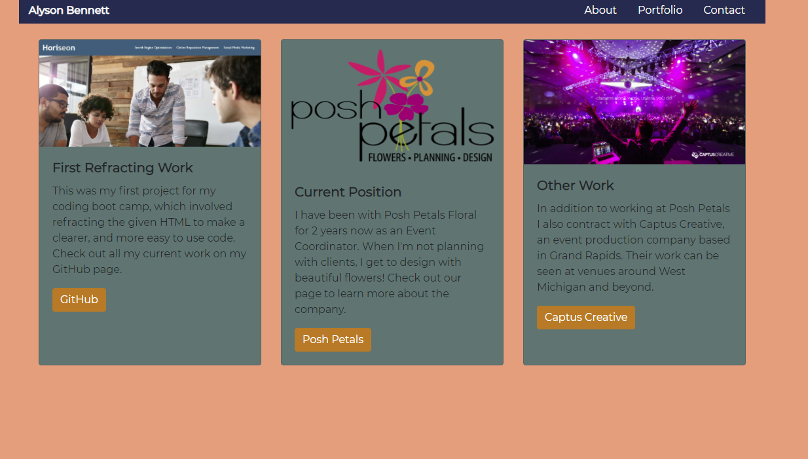
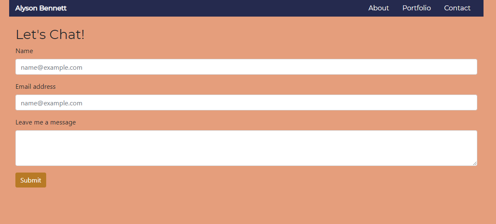

## My Portfolio - Alyson Bennett

## Link to Deployed Portfolio

[Portfolio](https://alysonbennett.github.io/MyPortfolio/)

The goal of this project was to create a responsive and personalized portfolio. This included a working navbar, a reponsive layout, and responsive images.  

To begin this project, I created 3 HTML files (named index.html, portfolio.html, and contact.html), as well as a CSS stylesheet.

From there, I browsed the Bootstrap website to find code that fit for my project.  After adding these codes, I altered them to fit my information. This included changing to semantic tags in places and also removing some lines of code that were not needed.

I added personalized contect in the About Me and Portfolio pages, as well as photos to reflect my experience.

I completed the project with adding color schemes to help break up the pages into readable sections. 

## Here are some screen shots of the completed pages:

Index (About Me Page)

Portfolio

Contact

## Here is a link to the final Responsive Portfolio

https://alysonbennett.github.io/MyPortfolio/

While I feel that I completed this project to the best of my current abilities, I am excited to remodel these pages as I learn more programming.

Thank you. 